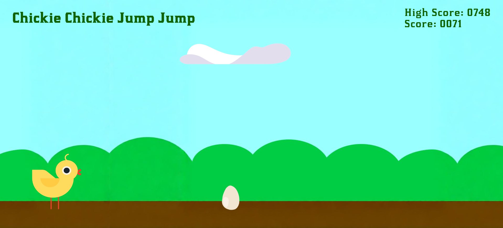

# Chickie Chickie Jump Jump
html+css+js version of one of the very first games that I made in scratch

## Features
- revamp of the game I made in scratch when i started to learn programming
- sound effects of jumping/cracking egg/losing game
- used a custom font from a .otf file
- high score stored in locAal storage
- added increasing speed as score increases
- egg img changes when chickie collide with it
- moving background + clouds

## Screenshot

## Credits
- made by me
- original concept by me (younger version)
- game inspiration from chrome dino
- font from: [https://www.1001fonts.com/kirsty-font.html](https://www.1001fonts.com/kirsty-font.html)
- all assets (bg + chickie + egg + sound effects) from: [https://scratch.mit.edu/](https://scratch.mit.edu/)
- AI help: dynamic speed update code + debugging playing sound(had to convert to .mp3 from .wav for the fix , rest was same)